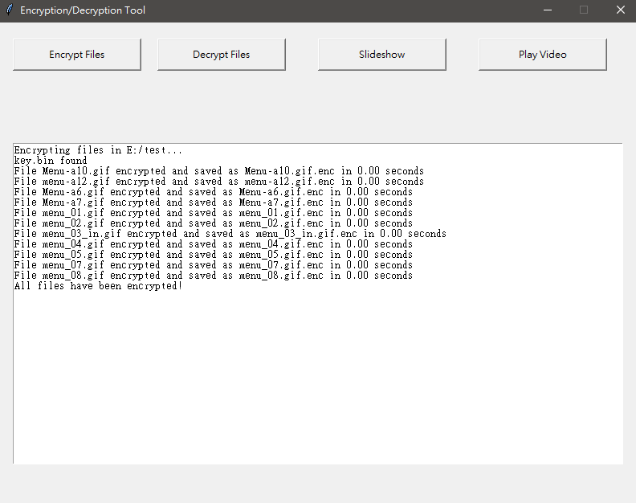

# EncryptTool
## This project provides four main features:
### 1.File Encryption
Encrypts all files within a specified folder path.
### 2.File Decryption
Decrypts all previously encrypted files within a specified folder path.
### 3.Slideshow
Reads encrypted images from a specified folder and displays them in a slideshow format, switching images every 3 seconds. The folder must contain images only.
### 4.Play Video
Decrypts the specified video file, writes it to disk, and launches it using the system’s default media player. After the media player process is closed, the video file is automatically deleted after a short delay.
Currently, only the following three media players are supported:
#### 1.Microsoft.Media.Player.exe
#### 2.vlc.exe
#### 3.PotPlayerMini64.exe

## Todo
### Support the following languages:  
#### 1.English
#### 2.日本語
#### 3.简体中文

### example

